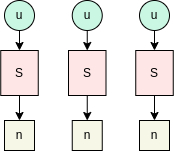
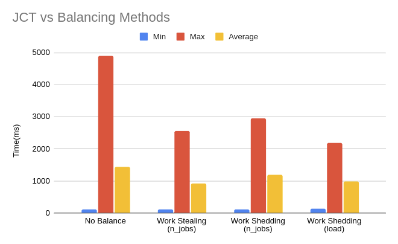

Simulation of Work Stealing and Work Shedding in FCFS schedulers

The simulator is setup as given above. Each Client publishes (either n jobs or perpetually) to one scheduler at a predefined rate as given in ./test/steal_test.ex. Each scheduler schedules a job in it's own core/node/machine. All jobs generated are assumed to take up all resources in the machine, i.e, only one job can run in a node at a time.

There are four kinds of algorithms considered in this simulation:

1. No Balancing: In this approach, each scheduler receives a job from a client and only it alone is responsible for scheduling the task in the machine/core it can view.

2. Work Stealing (num jobs): When a scheduler is idle, i.e, it has no more jobs to schedule, it triggers a work stealing request to a random scheduler. If the random scheduler has work (more than 1 job), it accepts the steal and sends back half it's queue (rear-end). Note: We don't use load (total duration of all tasks in the queue), we only use number of jobs.

3. Work Shedding (num jobs): When a scheduler is overloaded, i.e, it has >= threshold of 4 jobs in it's queue, it triggers a work shedding request to a random scheduler. If the random scheduler has no work. Then it replies with an accept and triggers the Work Stealing protocol (as in 2) to steal half of work from triggering scheduler.

4. Work Stealing (load): Same as 3, but here we use a different threshold = load, i.e, total duration of the jobs currently in the queue. If any scheduler has jobs amounting to more than 650ms, then it triggers a work shedding request to a random scheduler. If the random scheduler's load (total duration) is half of the scheduler which triggered the RPC, then it accepts the work and triggers work stealing protocol.

The protocols are triggered every 50 ms by each scheduler. Please check the top of the ./lib/scheduler.ex for these constants. 

# The core of the implementation

This implementation uses FIFO queues in the schedulers. Override next_schedule function in ./lib/scheduler.ex to implement whatever scheduler you like.

The RPC payloads are given at the bottom of ./lib/messages.ex: Line 120 onwards. 

The protocol can be seen at the bottom of the ./lib/scheduler.ex: Line 214 onwards.

Set @balance_type in ./lib/scheduler.ex to :steal for work stealing, :shed for work shedding (uses load by default), :none or anything else for no balancing.

In ./test/steal_test.ex: Line 12, you may give your own rates for job production. Currently, it's set at [[100, 500], [500, 100]], this mean, client 1 will publish jobs of 100 ms duration every 500 ms to scheduler 1 and client 2 will publish jobs of 500 ms duration every 100 ms to scheduler 1. This is a good example as there's ample opportunities for triggering the above protocols.

# Using the code

Requirements (same env as DS class):
- Elixir 2.0 [https://packages.erlang-solutions.com/erlang-solutions_2.0_all.deb] 
- Python 3.7+

### Steps to run
- Install requirements
- Clone Repo
- Run mix deps.get
- Run mix test (will run stealing by default)

Success paths of stealing and shedding a printed in stdout.

### Analyzing
- Each node/machine logs a job after the job runs for the given duration in a separate log file in ./logs/
- Run python3 analyze_trace.py:  This will merge the logs across different nodes/machines and calculate average JCT. To be handy, it also stores the full log tace in log_data.csv in root directory and also prints the table in stdout.

## Trace for Work Stealing

There are 20 jobs in total that are generated. 
Scheduler 1: PID: 164 is responsible for job ids 0-9
Scheduler 2: PID: 165 is responsible for job ids 10-19

Stolen jobs breach the above. Eg: Scheduler 164 works on job id 12 as given in row 2. Also in row 3.

|id |scheduler    |arrival_time|duration|start_time|finish_time|jct |
|---|-------------|------------|--------|----------|-----------|----|
|0  |#PID<0.164.0>|502         |100     |552       |653        |151 |
|12 |#PID<0.164.0>|755         |500     |822       |1334       |579 |
|13 |#PID<0.164.0>|856         |500     |1385      |1892       |1036|
|1  |#PID<0.164.0>|1012        |100     |1927      |2028       |1016|
|2  |#PID<0.164.0>|1519        |100     |2031      |2141       |622 |
|3  |#PID<0.164.0>|2020        |100     |2151      |2257       |237 |
|18 |#PID<0.164.0>|1395        |500     |2266      |2768       |1373|
|19 |#PID<0.164.0>|1496        |500     |2824      |3325       |1829|
|4  |#PID<0.164.0>|2523        |100     |3425      |3529       |1006|
|6  |#PID<0.164.0>|3532        |100     |3539      |3651       |119 |
|7  |#PID<0.164.0>|4091        |100     |4154      |4256       |165 |
|8  |#PID<0.164.0>|4601        |100     |4655      |4761       |160 |
|9  |#PID<0.164.0>|5113        |100     |5134      |5235       |122 |
|10 |#PID<0.165.0>|502         |500     |552       |1054       |552 |
|11 |#PID<0.165.0>|617         |500     |1102      |1613       |996 |
|14 |#PID<0.165.0>|974         |500     |1665      |2171       |1197|
|15 |#PID<0.165.0>|1080        |500     |2215      |2716       |1636|
|16 |#PID<0.165.0>|1191        |500     |2768      |3281       |2090|
|17 |#PID<0.165.0>|1294        |500     |3307      |3847       |2553|
|5  |#PID<0.165.0>|3031        |100     |3899      |4091       |1060|

# Results

Naive Work Stealing by just using job counts in queues performs better than all approaches on average.

Work Shedding using load information comes very close.

Both provide 2x better Job Completion Times on average vs no balancing.

# Reference
Referred only for base algorithm of work stealing and work shedding (Page 4):
McClure, Sarah, et al. "Efficient Scheduling Policies for {Microsecond-Scale} Tasks." 19th USENIX Symposium on Networked Systems Design and Implementation (NSDI 22). 2022.

___
The documentation isn't the best right now. Will come back to it some other time.

Happy Tinkering.